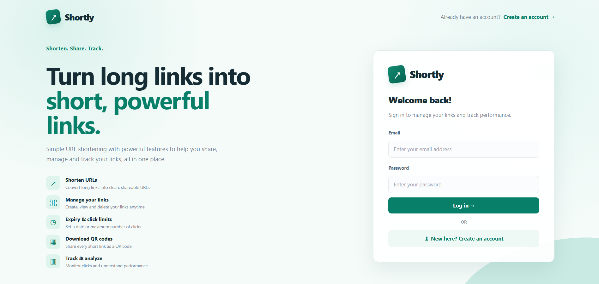
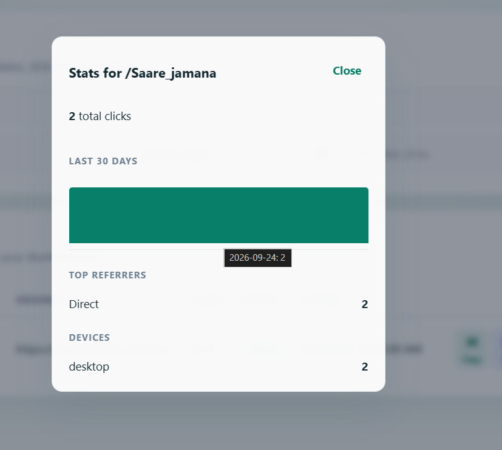
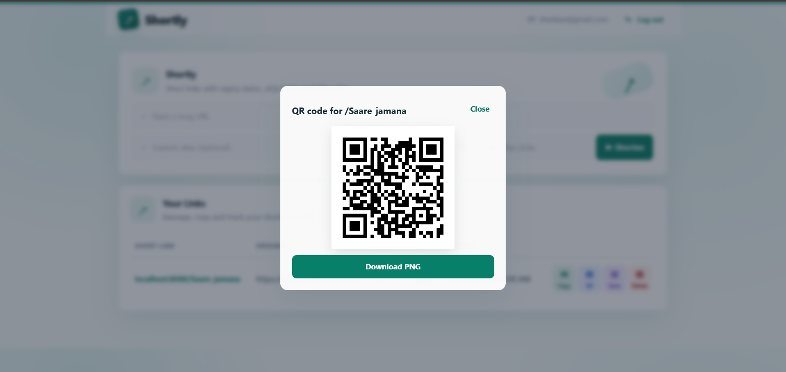

# Shortly

A focused URL shortener for creating, sharing, and tracking short links.

## Live demo

Try the deployed app at [http://3.108.57.76](http://3.108.57.76). The demo may be taken down later.

## Screenshots

The screenshot assets should live in `docs/screenshots/`.

| View | Preview |
|---|---|
| Dashboard |  |
| Create link |  |
| Link statistics |  |
| QR code |  |

## Features

- JWT authentication with registration and login
- Create, manage, and delete links
- Custom aliases
- Link expiry by date or maximum clicks
- QR code for each link with PNG download
- Click analytics by day, top referrers, and devices
- Rate limiting on authentication and link creation endpoints
- URL validation for HTTP and HTTPS links, including service-loop prevention

## Tech stack

[](https://react.dev/)
[](https://vitejs.dev/)
[](https://nodejs.org/)
[](https://expressjs.com/)
[](https://www.postgresql.org/)
[](https://www.docker.com/)
[](https://nginx.org/)
[](https://aws.amazon.com/)

## Architecture

```text
Browser -> Nginx -> Express API -> PostgreSQL (RDS)
```

Nginx serves the React build and forwards API and short-code requests to Express. In production, Express connects to PostgreSQL on Amazon RDS.

## How it works

- New links receive a random 7-character base62 code. Unique-constraint collisions are retried.
- Redirects use one atomic `UPDATE` query to check expiry and the click limit while incrementing the count, avoiding race conditions.
- Redirects return `302`, not `301`, so every click reaches the server for analytics.
- Click logging runs after the redirect response is sent to keep redirects fast.
- Only `http` and `https` URLs are accepted, and links pointing back to the service are rejected.
- Nginx serves the React build and proxies `/api` and short codes to the API.

## API endpoints

| Method | Path | Auth | Description |
|---|---|---:|---|
| GET | `/health` | No | Health check. |
| POST | `/api/auth/register` | No | Register and receive a JWT. |
| POST | `/api/auth/login` | No | Log in and receive a JWT. |
| POST | `/api/links` | Yes | Create a link with an optional alias, expiry, and click limit. |
| GET | `/api/links` | Yes | List the authenticated user's links. |
| DELETE | `/api/links/:id` | Yes | Delete one of the user's links. |
| GET | `/api/links/:id/stats` | Yes | Return clicks by day, referrers, and devices. |
| GET | `/api/qr/:code` | No | Return a QR code as PNG; use `?format=svg` for SVG. |
| GET | `/:code` | No | Redirect to the original URL, or return `410` when expired or limited. |

## Run locally with Docker

Copy `.env.example` to `.env` and set `JWT_SECRET` to a long random value. Then run:

```bash
docker compose up --build
```

Open [http://localhost:8080](http://localhost:8080). The Compose setup starts PostgreSQL, the Express API, and the Nginx-served React frontend. Database tables are created automatically when the API starts.

## Deploy on AWS

The production Compose file is designed for an Ubuntu EC2 instance connected to PostgreSQL on Amazon RDS. Configure `DATABASE_URL`, `JWT_SECRET`, and `BASE_URL` in the server environment, allow HTTP/HTTPS traffic to EC2, and allow PostgreSQL traffic from EC2 to RDS. Then run:

```bash
docker compose -f docker-compose.prod.yml up -d --build
```

The production setup runs the backend against RDS and exposes Nginx on port 80. Use a custom domain and HTTPS in front of the service for a production deployment.

## Project structure

```text
.
├── backend/
│   ├── src/
│   │   ├── db.js
│   │   ├── index.js
│   │   └── schema.sql
│   ├── Dockerfile
│   ├── package.json
│   └── package-lock.json
├── frontend/
│   ├── src/
│   │   ├── App.jsx
│   │   ├── main.jsx
│   │   └── styles.css
│   ├── Dockerfile
│   ├── index.html
│   ├── nginx.conf
│   ├── package.json
│   └── package-lock.json
├── docker-compose.prod.yml
├── docker-compose.yml
├── .env.example
└── README.md
```

## Future improvements

- Redis caching for redirects
- HTTPS with a custom domain
- GitHub Actions CI/CD
- Jest and Supertest coverage
- k6 load testing
